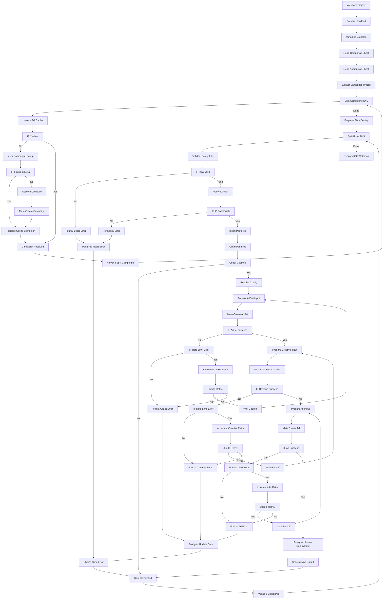

# Plan: Despliegue Batch de Múltiples Filas con Deduplicación y Reintentos

**Issue**: #4
**Estado**: 📝 En Planificación (Fase 2)
**Fecha**: 2026-05-20
**Rama**: `Issue-4-despliegue-batch`

---

## 1. Goal Description

El objetivo de este plan es reestructurar el script de compilación de n8n ([build_workflow.js](file:///e:/Development/N8NDev/DHfashion/bhfashion-auto/build_workflow.js)) para soportar el procesamiento por lotes (batch) de $N$ filas de Google Sheets de manera robusta y tolerante a fallas.

Esto requiere:
1. **Fase Preparación (Serial)**: Resolver todas las campañas requeridas en Meta (buscando en caché, Meta, o creándolas) antes de lanzar los despliegues de anuncios.
2. **Fase Despliegue (Paralelo N=5)**: Agrupar el procesamiento de las filas de 5 en 5.
3. **Mecanismo de Reintentos de Meta**: Capturar errores de rate limit (17/32) en la creación de AdSets, Creativos y Ads, aplicando un retraso exponencial (30s, 60s, 120s) y reintentando hasta 3 veces antes de marcar la fila como `Error`.
4. **Independencia de Filas**: Una fila que falle en validación o en Meta no debe bloquear ni revertir el despliegue del resto del batch.

---

## 2. User Review Required

> [!IMPORTANT]
> **Cambio de Respuesta del Webhook**:
> Anteriormente, el webhook respondía con el ID de campaña, AdSet y Ad de la única fila procesada. Ahora, al procesar en lotes, la respuesta HTTP del webhook responderá `{ "status": "finished" }` al finalizar todo el lote, ya que el estado individual de cada fila (éxito o error con detalles) se sincroniza directamente en Postgres y en Google Sheets fila por fila en tiempo real.

> [!TIP]
> **Mecanismo de Reintento de Rate Limit**:
> El control del reintento de rate limit se maneja en memoria a nivel de item usando un nodo Code intermedio (`Prepare Input`). Al ocurrir un error 17 o 32 de Meta, se calcula el `backoff_seconds` y se usa el nodo `Wait` de n8n para pausar ese item individual antes de retornar al nodo de creación. Esto evita que los hilos no bloqueados sufran demoras innecesarias.

---

## 3. Open Questions

No hay preguntas abiertas pendientes; las especificaciones del lote y los mecanismos de deduplicación y reintento están alineados con el PRD y el comportamiento deseado.

---

## 4. Proposed Changes

### [MODIFY] [build_workflow.js](file:///e:/Development/N8NDev/DHfashion/bhfashion-auto/build_workflow.js)

Reemplazaremos la definición de nodos y conexiones en `build_workflow.js` con la siguiente arquitectura:

---

## 5. Verification Plan

### Test Gates de Verificación

#### Test Gate 1: Compilación Exitosa del Workflow
* **Acción**: Ejecutar `node build_workflow.js` en la consola.
* **Validación**: El script debe compilar sin errores de sintaxis y sobrescribir el archivo `meta-ads-deploy-compiled.json` con la estructura JSON correspondiente.

#### Test Gate 2: Deduplicación de Campañas (Fase Preparación)
* **Acción**: Enviar un webhook de prueba simulado con un lote de 10 filas que referencien 3 campañas distintas (por ejemplo, Campaña A x4, Campaña B x4, Campaña C x2).
* **Validación**: 
  - La Fase 1 debe ejecutarse de forma secuencial (tamaño de lote 1).
  - La base de datos `campaigns_meta` debe registrar exactamente 3 campañas únicas y sus correspondientes `campaign_id`. No debe haber duplicados.

#### Test Gate 3: Procesamiento en Paralelo (N=5)
* **Acción**: Enviar un webhook de prueba con un lote de 10 filas.
* **Validación**:
  - Las primeras 5 filas deben ingresar al subflujo de validación e iniciar llamadas a Meta de forma paralela.
  - El tiempo total para procesar las 10 filas debe ser inferior a 60 segundos.

#### Test Gate 4: Tolerancia a Fallos e Independencia de Filas
* **Acción**: Enviar un batch con 5 filas válidas y 2 filas corruptas (por ejemplo, sin presupuesto o con URL de Instagram inválida).
* **Validación**:
  - Las 2 filas corruptas deben fallar inmediatamente en la validación local pre-claim, registrando su error en Postgres y Sheets sin bloquear las 5 filas válidas.
  - Las 5 filas válidas deben completarse con éxito (creando AdSets, Creativos y Ads en Meta).

#### Test Gate 5: Reintento Automático y Backoff Exponencial
* **Acción**: Simular un error de rate limit (código 17 o 32) en la llamada a `Meta Create AdSet` usando un mock del API o forzando la respuesta de Meta.
* **Validación**:
  - El flujo debe capturar el error, esperar 30 segundos en el primer intento, y reintentar.
  - Si el segundo intento falla, debe esperar 60 segundos y reintentar.
  - Si falla el tercer intento, debe registrar la fila en Postgres con estado `Error` y detallar en `error_log` el mensaje de error de rate limit de Meta.
